# Marjorie — AI Resume Agent (AWS IaC)

Serverless infrastructure for **Marjorie**, an AI-powered resume chatbot deployed at [yinxuanh.cc](https://yinxuanh.cc). Visitors can ask Marjorie questions about the site owner's professional background in natural language. Marjorie answers in the visitor's language (English / Traditional Chinese) and politely declines off-topic questions.

Everything here is AWS CloudFormation (nested stacks) with no custom servers — requests go from API Gateway directly into a Step Functions Express workflow that hits DynamoDB and AWS Bedrock.

---

## Architecture

```
Visitor
  │
  ▼
API Gateway (REST, API Key + Usage Plan)
  │  POST /
  ▼
Step Functions Express Workflow
  │
  ├─► DynamoDB: config-table       ← system prompt, per-user & daily AI limits
  ├─► DynamoDB: daily-limited-table ← tracks daily AI invocation count
  ├─► DynamoDB: customer-table     ← tracks per-visitor AI request count
  ├─► DynamoDB: conversation-table ← stores every conversation turn
  │
  └─► AWS Bedrock InvokeModel      ← LLM call (see model note below)

EventBridge Scheduler (daily, 00:00 UTC)
  │
  └─► Lambda: ResetCustomerAiRequestCount ← resets per-visitor aiRequestCount daily
```

### Key design decisions

| Concern | Solution |
|---|---|
| No cold-start latency | Step Functions Express (synchronous, no Lambda between API GW and Bedrock) |
| Rate limiting | Two-layer: per-visitor `aiRequestLimit` + global daily `aiRequestLimitDaily` stored in DynamoDB |
| Bot detection | Frontend sends `humanDetectionData` (mouse moves, focus events, touch events); Step Functions enforces `isHuman` gate before LLM call |
| Config hot-reload | `config-table` stores versioned system prompts; Step Functions reads `SK=latest` on every request — no redeploy needed |
| Cost control | API Gateway Usage Plan caps daily requests at the gateway level as a first guard |

---

## AWS Services Used

| Service | Purpose |
|---|---|
| **CloudFormation** | Infrastructure as Code, nested stacks |
| **S3** | Hosts nested stack YAML templates + DynamoDB seed data |
| **DynamoDB** | Four tables: config, conversation, customer, daily-limited |
| **Step Functions** (Express) | Orchestrates the entire chat workflow without Lambda |
| **API Gateway** (REST) | Public webhook endpoint with API key auth and usage plan |
| **AWS Bedrock** | LLM inference (`InvokeModel`) |
| **Lambda** | Daily job to reset per-visitor AI request counters |
| **EventBridge Scheduler** | Cron trigger for the Lambda reset job |
| **IAM** | Scoped roles and inline policies for each service |
| **CloudWatch Logs** | Step Functions execution logs |
| **X-Ray** | Distributed tracing for Step Functions |

---

## Repository Structure

```
nested_stacks/new/
├── main.yaml                                    # Root stack — wires all nested stacks together
├── s3.yaml                                      # S3 bucket for template and config hosting
├── dynamodb.yaml                                # Four DynamoDB tables + seed data import
├── step_machine_webappAiAgent.yaml              # Step Functions state machine (core workflow)
├── api_gateway_endpoint.yaml                    # REST API Gateway endpoint
├── api_gateway_usage_plan.yaml                  # API key + usage plan + throttle
├── lambda_function_ResetCustomerAiRequestCount.yaml  # Daily reset Lambda
├── schedule_ResetCustomerAiRequestCount.yaml    # EventBridge Scheduler for the Lambda
└── configDynamodbTableDefaultData.json          # Seed data for config-table (system prompt template)
```

---

## Prerequisites

- AWS CLI configured (`aws configure`)
- An AWS account with Bedrock model access enabled for your chosen model
- Sufficient IAM permissions to create CloudFormation stacks with `CAPABILITY_NAMED_IAM`

---

## Deployment

### Step 1 — Create the S3 bucket

The S3 bucket stores the nested stack YAML templates and the DynamoDB seed file. The bucket name must match the `{ProjectName}-{ProjectSuffixName}` pattern used throughout the stacks.

```bash
aws cloudformation create-stack \
  --stack-name {your-project-name}-{your-suffix}-s3-bucket \
  --template-body file://s3.yaml \
  --parameters \
    ParameterKey="ProjectName",ParameterValue="{your-project-name}" \
    ParameterKey="ProjectSuffixName",ParameterValue="{your-suffix}"
```

### Step 2 — Upload templates and seed data to S3

```bash
aws s3 cp configDynamodbTableDefaultData.json s3://{your-project-name}-{your-suffix}/
aws s3 cp dynamodb.yaml                        s3://{your-project-name}-{your-suffix}/
aws s3 cp lambda_function_ResetCustomerAiRequestCount.yaml s3://{your-project-name}-{your-suffix}/
aws s3 cp schedule_ResetCustomerAiRequestCount.yaml        s3://{your-project-name}-{your-suffix}/
aws s3 cp step_machine_webappAiAgent.yaml      s3://{your-project-name}-{your-suffix}/
aws s3 cp api_gateway_endpoint.yaml            s3://{your-project-name}-{your-suffix}/
aws s3 cp api_gateway_usage_plan.yaml          s3://{your-project-name}-{your-suffix}/
```

### Step 3 — Deploy the root stack

This single command creates all nested stacks in dependency order:

```bash
aws cloudformation create-stack \
  --stack-name {your-project-name}-{your-suffix}-root \
  --template-body file://main.yaml \
  --parameters \
    ParameterKey="ProjectName",ParameterValue="{your-project-name}" \
    ParameterKey="ProjectSuffixName",ParameterValue="{your-suffix}" \
    ParameterKey="ConfigPopulationFileName",ParameterValue="configDynamodbTableDefaultData.json" \
  --capabilities CAPABILITY_NAMED_IAM
```

The root stack output `WebHookApiGateway` is the endpoint URL your frontend should POST to.

---

## Individual Stack Testing

You can deploy each nested stack independently for testing. Replace the placeholder ARNs with actual values from previously deployed stacks.

<details>
<summary>Test API Gateway endpoint only</summary>

```bash
aws cloudformation create-stack \
  --stack-name {your-project-name}-{your-suffix}-endpoint \
  --template-body file://api_gateway_endpoint.yaml \
  --parameters \
    ParameterKey="ProjectName",ParameterValue="{your-project-name}" \
    ParameterKey="ProjectSuffixName",ParameterValue="{your-suffix}" \
    ParameterKey="StepFunctionArn",ParameterValue="arn:aws:states:{your-region}:{your-account-id}:stateMachine:{your-state-machine-name}" \
  --capabilities CAPABILITY_NAMED_IAM
```
</details>

<details>
<summary>Test DynamoDB tables only</summary>

```bash
aws cloudformation create-stack \
  --stack-name {your-project-name}-{your-suffix}-dynamodb \
  --template-body file://dynamodb.yaml \
  --parameters \
    ParameterKey="ProjectName",ParameterValue="{your-project-name}" \
    ParameterKey="ProjectSuffixName",ParameterValue="{your-suffix}" \
    ParameterKey="ConfigPopulationFileName",ParameterValue="configDynamodbTableDefaultData.json" \
  --capabilities CAPABILITY_NAMED_IAM
```
</details>

<details>
<summary>Test Lambda function only</summary>

```bash
aws cloudformation create-stack \
  --stack-name {your-project-name}-{your-suffix}-lambda-reset \
  --template-body file://lambda_function_ResetCustomerAiRequestCount.yaml \
  --parameters \
    ParameterKey="ProjectName",ParameterValue="{your-project-name}" \
    ParameterKey="ProjectSuffixName",ParameterValue="{your-suffix}" \
    ParameterKey="CustomerTableName",ParameterValue="{your-project-name}-{your-suffix}-customer-table" \
    ParameterKey="CustomerTableArn",ParameterValue="arn:aws:dynamodb:{your-region}:{your-account-id}:table/{your-project-name}-{your-suffix}-customer-table" \
  --capabilities CAPABILITY_NAMED_IAM
```
</details>

<details>
<summary>Test EventBridge Scheduler only</summary>

```bash
aws cloudformation create-stack \
  --stack-name {your-project-name}-{your-suffix}-schedule-reset \
  --template-body file://schedule_ResetCustomerAiRequestCount.yaml \
  --parameters \
    ParameterKey="ProjectName",ParameterValue="{your-project-name}" \
    ParameterKey="ProjectSuffixName",ParameterValue="{your-suffix}" \
    ParameterKey="ResetCustomerAiRequestCountFunctionArn",ParameterValue="arn:aws:lambda:{your-region}:{your-account-id}:function:{your-function-name}" \
  --capabilities CAPABILITY_NAMED_IAM
```
</details>

<details>
<summary>Test Step Functions state machine only</summary>

```bash
aws cloudformation create-stack \
  --stack-name {your-project-name}-{your-suffix}-stepMachine \
  --template-body file://step_machine_webappAiAgent.yaml \
  --parameters \
    ParameterKey="ProjectName",ParameterValue="{your-project-name}" \
    ParameterKey="ProjectSuffixName",ParameterValue="{your-suffix}" \
    ParameterKey="ConfigTableName",ParameterValue="{your-project-name}-{your-suffix}-config-table" \
    ParameterKey="ConverstationTableName",ParameterValue="{your-project-name}-{your-suffix}-conversation-table" \
    ParameterKey="CustomerTableName",ParameterValue="{your-project-name}-{your-suffix}-customer-table" \
    ParameterKey="DailyLimitedTableName",ParameterValue="{your-project-name}-{your-suffix}-daily-limited-table" \
    ParameterKey="ConfigTableArn",ParameterValue="arn:aws:dynamodb:{your-region}:{your-account-id}:table/{your-project-name}-{your-suffix}-config-table" \
    ParameterKey="ConverstationTableArn",ParameterValue="arn:aws:dynamodb:{your-region}:{your-account-id}:table/{your-project-name}-{your-suffix}-conversation-table" \
    ParameterKey="CustomerTableArn",ParameterValue="arn:aws:dynamodb:{your-region}:{your-account-id}:table/{your-project-name}-{your-suffix}-customer-table" \
    ParameterKey="DailyLimitedTableArn",ParameterValue="arn:aws:dynamodb:{your-region}:{your-account-id}:table/{your-project-name}-{your-suffix}-daily-limited-table" \
  --capabilities CAPABILITY_NAMED_IAM
```
</details>

---

## Configuration

### Customising the system prompt

Edit `configDynamodbTableDefaultData.json` before uploading to S3. The file seeds the `config-table` with two items:

- `SK: "20250101"` — a versioned snapshot
- `SK: "latest"` — the active config pointer (the `version` field links it to a snapshot)

Key fields:

| Field | Type | Purpose |
|---|---|---|
| `systemPrompt` | String | XML-structured resume + assistant persona injected into every Bedrock request |
| `aiRequestLimit` | Number | Max AI calls per visitor per day (individual cap) |
| `aiRequestLimitDaily` | Number | Max AI calls across all visitors per day (global cap) |

To update the prompt without redeploying, write a new versioned item to `config-table` and update `SK=latest` to point to it — Step Functions picks it up on the next request.

### API key

After deployment, retrieve the generated API key from the AWS Console (API Gateway → API Keys) and pass it as the `x-api-key` header in your frontend requests.

---

## ⚠️ Important: Bedrock Model Deprecation

The current `step_machine_webappAiAgent.yaml` uses:

```
anthropic.claude-3-haiku-20240307-v1:0
```

**This model ID is no longer supported by AWS Bedrock's `InvokeModel` API.**

### Recommended alternatives

| Model | Model ID | Notes |
|---|---|---|
| **DeepSeek-R1** | `deepseek-ai/deepseek-r1` (via Bedrock Marketplace) | Strong reasoning, cost-effective |
| **Amazon Nova Micro** | `amazon.nova-micro-v1:0` | Fastest and cheapest AWS-native option |
| **Amazon Nova Lite** | `amazon.nova-lite-v1:0` | Good balance of speed and quality |
| **Claude 3.5 Haiku** | `anthropic.claude-3-5-haiku-20241022-v1:0` | Drop-in Claude replacement, more capable |

To switch models, update the `bedrock_ModelId_claude_3_haiku` substitution in `step_machine_webappAiAgent.yaml` and the corresponding IAM policy resource ARN in `BedrockPolicyStepMachine`.

> **DeepSeek tip**: DeepSeek models on Bedrock use the same `InvokeModel` API and Anthropic-compatible message format, making migration straightforward. Check [Bedrock model access](https://console.aws.amazon.com/bedrock/home#/modelaccess) to enable the model in your account before deploying.

---

## Step Functions Workflow

The state machine uses **JSONata** query language and runs as an **EXPRESS** (synchronous) workflow so API Gateway can receive the response inline.

```mermaid
flowchart TD
    Start([Start]) --> GetConfig

    GetConfig["Get Config Data
    DynamoDB: config-table · SK = latest
    Reads: systemPrompt · aiRequestLimit · aiRequestLimitDaily"]
    GetConfig --> GetDaily

    GetDaily["Get Daily Limited Data
    DynamoDB: daily-limited-table
    Key: today's date"]
    GetDaily --> IsDailyExist

    IsDailyExist{Is daily exist?}
    IsDailyExist -- Yes --> UpdateRequestUsageDaily
    IsDailyExist -- No  --> InsertNewDaily

    UpdateRequestUsageDaily["Update requestUsageDaily
    requestUsageDaily += 1"]
    InsertNewDaily["Insert a new daily
    aiRequestUsageDaily = 0 · requestUsageDaily = 1"]

    UpdateRequestUsageDaily --> GetCustomer
    InsertNewDaily          --> GetCustomer

    GetCustomer["Get Customer Data
    DynamoDB: customer-table
    Key: fingerprintId + clientKey"]
    GetCustomer --> IsCustomerExist

    IsCustomerExist{Is customer exist?}
    IsCustomerExist -- Yes --> UpdateRequestCount
    IsCustomerExist -- No  --> InsertNewCustomer

    UpdateRequestCount["Update requestCount
    requestCount += 1"]
    InsertNewCustomer["Insert a new customer
    aiRequestCount = 0 · requestCount = 1"]

    UpdateRequestCount --> IsDailyQuota
    InsertNewCustomer  --> IsDailyQuota

    IsDailyQuota{"Is daily AI quota exceeded?
    aiRequestUsageDaily ≥ aiRequestLimitDaily"}
    IsDailyQuota -- Yes --> NoDailyQuota
    IsDailyQuota -- No  --> IsPerVisitorQuota

    NoDailyQuota["Pass: No daily AI request quota
    responseText = daily quota exceeded msg"]

    IsPerVisitorQuota{"Is per-visitor quota exceeded?
    aiRequestCount ≥ aiRequestLimit"}
    IsPerVisitorQuota -- Yes --> NoPerVisitorQuota
    IsPerVisitorQuota -- No  --> IsHuman

    NoPerVisitorQuota["Pass: No AI request quota
    responseText = per-visitor quota exceeded msg"]

    IsHuman{"Is request from human?
    isHuman == true"}
    IsHuman -- No  --> NotHuman
    IsHuman -- Yes --> Bedrock

    NotHuman["Pass: Not request from human
    responseText = bot detected msg"]

    Bedrock["Bedrock InvokeModel
    Model: Claude 3 Haiku · max_tokens: 600
    Appends remaining quota count to responseText"]
    Bedrock --> UpdateAiUsageDaily

    UpdateAiUsageDaily["Update aiRequestUsageDaily
    DynamoDB: daily-limited-table
    aiRequestUsageDaily += 1"]
    UpdateAiUsageDaily --> UpdateAiRequestCount

    UpdateAiRequestCount["Update aiRequestCount
    DynamoDB: customer-table
    aiRequestCount += 1"]
    UpdateAiRequestCount --> InsertConversation

    NoDailyQuota      --> InsertConversation
    NoPerVisitorQuota --> InsertConversation
    NotHuman          --> InsertConversation

    InsertConversation["Insert a new conversation
    DynamoDB: conversation-table
    Stores: message · responseText · tokens · human signals · lang"]
    InsertConversation --> End([End — return responseText])

    classDef task   fill:#dbeafe,stroke:#3b82f6,color:#1e3a5f
    classDef choice fill:#fef3c7,stroke:#f59e0b,color:#78350f
    classDef pass   fill:#f3f4f6,stroke:#9ca3af,color:#374151
    classDef term   fill:#dcfce7,stroke:#22c55e,color:#14532d

    class GetConfig,GetDaily,UpdateRequestUsageDaily,InsertNewDaily,GetCustomer,UpdateRequestCount,InsertNewCustomer,Bedrock,UpdateAiUsageDaily,UpdateAiRequestCount,InsertConversation task
    class IsDailyExist,IsCustomerExist,IsDailyQuota,IsPerVisitorQuota,IsHuman choice
    class NoDailyQuota,NoPerVisitorQuota,NotHuman pass
    class Start,End term
```



---

## License

MIT
