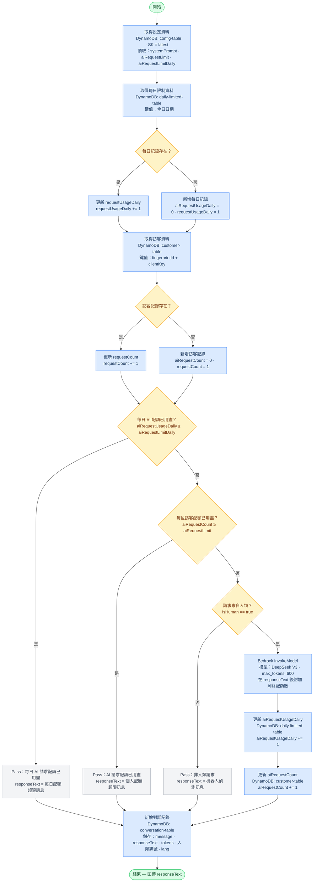

# Marjorie — AI 履歷助理（AWS IaC）

[English](README.md) | [繁體中文](README.zh-TW.md)

Serverless 基礎設施，驅動 **Marjorie**——一個 AI 履歷聊天機器人，部署於 [yinxuanh.cc](https://yinxuanh.cc)。訪客可以用自然語言詢問網站主人的職業背景，Marjorie 會以訪客的語言回覆（英文／繁體中文），並婉拒與主題無關的問題。

整個架構採用 AWS CloudFormation（巢狀堆疊），無需自訂伺服器——請求從 API Gateway 直接進入 Step Functions Express 工作流程，再存取 DynamoDB 與 AWS Bedrock。

---

## 架構

```
訪客
  │
  ▼
API Gateway（REST，API Key + Usage Plan）
  │  POST /
  ▼
Step Functions Express 工作流程
  │
  ├─► DynamoDB: config-table        ← 系統提示、每位訪客與每日 AI 配額上限
  ├─► DynamoDB: daily-limited-table ← 追蹤每日 AI 呼叫次數
  ├─► DynamoDB: customer-table      ← 追蹤每位訪客的 AI 請求次數
  ├─► DynamoDB: conversation-table  ← 儲存每一輪對話紀錄
  │
  └─► AWS Bedrock InvokeModel       ← LLM 呼叫（詳見下方模型說明）

EventBridge Scheduler（每日 00:00 UTC）
  │
  └─► Lambda: ResetCustomerAiRequestCount ← 每日重置每位訪客的 aiRequestCount
```

### 關鍵設計決策

| 考量 | 解決方案 |
|---|---|
| 無冷啟動延遲 | Step Functions Express（同步執行，API GW 與 Bedrock 之間不經過 Lambda） |
| 速率限制 | 雙層機制：每位訪客的 `aiRequestLimit` + 儲存於 DynamoDB 的全域每日 `aiRequestLimitDaily` |
| 機器人偵測 | 前端傳送 `humanDetectionData`（滑鼠移動、焦點事件、觸控事件）；Step Functions 在呼叫 LLM 前強制執行 `isHuman` 閘道 |
| 設定熱更新 | `config-table` 儲存含版本號的系統提示；Step Functions 每次請求讀取 `SK=latest`，無需重新部署 |
| 成本控制 | API Gateway Usage Plan 在閘道層級設定每日請求上限作為第一道防線 |

---

## 使用的 AWS 服務

| 服務 | 用途 |
|---|---|
| **CloudFormation** | 基礎設施即程式碼，巢狀堆疊 |
| **S3** | 存放巢狀堆疊 YAML 範本與 DynamoDB 種子資料 |
| **DynamoDB** | 四張資料表：config、conversation、customer、daily-limited |
| **Step Functions**（Express） | 不經 Lambda 協調整個聊天工作流程 |
| **API Gateway**（REST） | 公開 Webhook 端點，搭配 API Key 驗證與使用計畫 |
| **AWS Bedrock** | LLM 推論（`InvokeModel`） |
| **Lambda** | 每日重置每位訪客 AI 請求計數的排程任務 |
| **EventBridge Scheduler** | 觸發 Lambda 重置任務的 Cron 排程 |
| **IAM** | 為各服務設置範圍限定的角色與內聯政策 |
| **CloudWatch Logs** | Step Functions 執行日誌 |
| **X-Ray** | Step Functions 的分散式追蹤 |

---

## 專案結構

```
nested_stacks/new/
├── main.yaml                                    # 根堆疊 — 串接所有巢狀堆疊
├── s3.yaml                                      # 存放範本與設定的 S3 Bucket
├── dynamodb.yaml                                # 四張 DynamoDB 資料表 + 種子資料匯入
├── step_machine_webappAiAgent.yaml              # Step Functions 狀態機（核心工作流程）
├── api_gateway_endpoint.yaml                    # REST API Gateway 端點
├── api_gateway_usage_plan.yaml                  # API Key + 使用計畫 + 流量限制
├── lambda_function_ResetCustomerAiRequestCount.yaml  # 每日重置 Lambda
├── schedule_ResetCustomerAiRequestCount.yaml    # Lambda 的 EventBridge Scheduler
└── configDynamodbTableDefaultData.json          # config-table 種子資料（系統提示範本）
```

---

## 前置條件

- 已設定 AWS CLI（`aws configure`）
- AWS 帳號已為選用模型開啟 Bedrock 模型存取權限
- 具備足夠的 IAM 權限，可使用 `CAPABILITY_NAMED_IAM` 建立 CloudFormation 堆疊

---

## 部署步驟

### Step 1 — 建立 S3 Bucket

S3 Bucket 用於存放巢狀堆疊 YAML 範本與 DynamoDB 種子檔案。Bucket 名稱必須符合各堆疊使用的 `{ProjectName}-{ProjectSuffixName}` 格式。

```bash
aws cloudformation create-stack \
  --stack-name {your-project-name}-{your-suffix}-s3-bucket \
  --template-body file://s3.yaml \
  --parameters \
    ParameterKey="ProjectName",ParameterValue="{your-project-name}" \
    ParameterKey="ProjectSuffixName",ParameterValue="{your-suffix}"
```

### Step 2 前 — 自訂系統提示

> **初次設定**：開啟 `configDynamodbTableDefaultData.json`，編輯 `systemPrompt` 欄位，填入您自己的職業背景描述。此檔案是 `config-table` 的種子資料，將於下一步上傳——上傳後的修改需直接更新 DynamoDB。您也可以在同一個檔案中調整 `aiRequestLimit`（每位訪客每日上限）和 `aiRequestLimitDaily`（全域每日上限）。
>
> 完整欄位說明請參閱[設定](#設定)章節。

### Step 2 — 上傳範本與種子資料至 S3

```bash
aws s3 cp configDynamodbTableDefaultData.json s3://{your-project-name}-{your-suffix}/
aws s3 cp dynamodb.yaml                        s3://{your-project-name}-{your-suffix}/
aws s3 cp lambda_function_ResetCustomerAiRequestCount.yaml s3://{your-project-name}-{your-suffix}/
aws s3 cp schedule_ResetCustomerAiRequestCount.yaml        s3://{your-project-name}-{your-suffix}/
aws s3 cp step_machine_webappAiAgent.yaml      s3://{your-project-name}-{your-suffix}/
aws s3 cp api_gateway_endpoint.yaml            s3://{your-project-name}-{your-suffix}/
aws s3 cp api_gateway_usage_plan.yaml          s3://{your-project-name}-{your-suffix}/
```

### Step 3 — 部署根堆疊

這道指令會依照相依順序建立所有巢狀堆疊：

```bash
aws cloudformation create-stack \
  --stack-name {your-project-name}-{your-suffix}-root \
  --template-body file://main.yaml \
  --parameters \
    ParameterKey="ProjectName",ParameterValue="{your-project-name}" \
    ParameterKey="ProjectSuffixName",ParameterValue="{your-suffix}" \
    ParameterKey="ConfigPopulationFileName",ParameterValue="configDynamodbTableDefaultData.json" \
  --capabilities CAPABILITY_NAMED_IAM
```

根堆疊的輸出值 `WebHookApiGateway` 即為前端應 POST 的端點 URL。

---

## 個別堆疊測試

您可以獨立部署每個巢狀堆疊進行測試。請將佔位符 ARN 替換為先前已部署堆疊的實際值。

<details>
<summary>僅測試 API Gateway 端點</summary>

```bash
aws cloudformation create-stack \
  --stack-name {your-project-name}-{your-suffix}-endpoint \
  --template-body file://api_gateway_endpoint.yaml \
  --parameters \
    ParameterKey="ProjectName",ParameterValue="{your-project-name}" \
    ParameterKey="ProjectSuffixName",ParameterValue="{your-suffix}" \
    ParameterKey="StepFunctionArn",ParameterValue="arn:aws:states:{your-region}:{your-account-id}:stateMachine:{your-state-machine-name}" \
  --capabilities CAPABILITY_NAMED_IAM
```
</details>

<details>
<summary>僅測試 DynamoDB 資料表</summary>

```bash
aws cloudformation create-stack \
  --stack-name {your-project-name}-{your-suffix}-dynamodb \
  --template-body file://dynamodb.yaml \
  --parameters \
    ParameterKey="ProjectName",ParameterValue="{your-project-name}" \
    ParameterKey="ProjectSuffixName",ParameterValue="{your-suffix}" \
    ParameterKey="ConfigPopulationFileName",ParameterValue="configDynamodbTableDefaultData.json" \
  --capabilities CAPABILITY_NAMED_IAM
```
</details>

<details>
<summary>僅測試 Lambda 函式</summary>

```bash
aws cloudformation create-stack \
  --stack-name {your-project-name}-{your-suffix}-lambda-reset \
  --template-body file://lambda_function_ResetCustomerAiRequestCount.yaml \
  --parameters \
    ParameterKey="ProjectName",ParameterValue="{your-project-name}" \
    ParameterKey="ProjectSuffixName",ParameterValue="{your-suffix}" \
    ParameterKey="CustomerTableName",ParameterValue="{your-project-name}-{your-suffix}-customer-table" \
    ParameterKey="CustomerTableArn",ParameterValue="arn:aws:dynamodb:{your-region}:{your-account-id}:table/{your-project-name}-{your-suffix}-customer-table" \
  --capabilities CAPABILITY_NAMED_IAM
```
</details>

<details>
<summary>僅測試 EventBridge Scheduler</summary>

```bash
aws cloudformation create-stack \
  --stack-name {your-project-name}-{your-suffix}-schedule-reset \
  --template-body file://schedule_ResetCustomerAiRequestCount.yaml \
  --parameters \
    ParameterKey="ProjectName",ParameterValue="{your-project-name}" \
    ParameterKey="ProjectSuffixName",ParameterValue="{your-suffix}" \
    ParameterKey="ResetCustomerAiRequestCountFunctionArn",ParameterValue="arn:aws:lambda:{your-region}:{your-account-id}:function:{your-function-name}" \
  --capabilities CAPABILITY_NAMED_IAM
```
</details>

<details>
<summary>僅測試 Step Functions 狀態機</summary>

```bash
aws cloudformation create-stack \
  --stack-name {your-project-name}-{your-suffix}-stepMachine \
  --template-body file://step_machine_webappAiAgent.yaml \
  --parameters \
    ParameterKey="ProjectName",ParameterValue="{your-project-name}" \
    ParameterKey="ProjectSuffixName",ParameterValue="{your-suffix}" \
    ParameterKey="ConfigTableName",ParameterValue="{your-project-name}-{your-suffix}-config-table" \
    ParameterKey="ConverstationTableName",ParameterValue="{your-project-name}-{your-suffix}-conversation-table" \
    ParameterKey="CustomerTableName",ParameterValue="{your-project-name}-{your-suffix}-customer-table" \
    ParameterKey="DailyLimitedTableName",ParameterValue="{your-project-name}-{your-suffix}-daily-limited-table" \
    ParameterKey="ConfigTableArn",ParameterValue="arn:aws:dynamodb:{your-region}:{your-account-id}:table/{your-project-name}-{your-suffix}-config-table" \
    ParameterKey="ConverstationTableArn",ParameterValue="arn:aws:dynamodb:{your-region}:{your-account-id}:table/{your-project-name}-{your-suffix}-conversation-table" \
    ParameterKey="CustomerTableArn",ParameterValue="arn:aws:dynamodb:{your-region}:{your-account-id}:table/{your-project-name}-{your-suffix}-customer-table" \
    ParameterKey="DailyLimitedTableArn",ParameterValue="arn:aws:dynamodb:{your-region}:{your-account-id}:table/{your-project-name}-{your-suffix}-daily-limited-table" \
  --capabilities CAPABILITY_NAMED_IAM
```
</details>

---

## 清除資源

若要移除所有已部署的資源，請先刪除根堆疊（CloudFormation 會串聯刪除所有巢狀堆疊），再清空並刪除 S3 Bucket 堆疊。

### Step 1 — 刪除根堆疊

```bash
aws cloudformation delete-stack \
  --stack-name {your-project-name}-{your-suffix}-root

aws cloudformation wait stack-delete-complete \
  --stack-name {your-project-name}-{your-suffix}-root
```

### Step 2 — 清空 S3 Bucket

CloudFormation 無法刪除非空的 Bucket，請先清空：

```bash
aws s3 rm s3://{your-project-name}-{your-suffix} --recursive
```

### Step 3 — 刪除 S3 Bucket 堆疊

```bash
aws cloudformation delete-stack \
  --stack-name {your-project-name}-{your-suffix}-s3-bucket

aws cloudformation wait stack-delete-complete \
  --stack-name {your-project-name}-{your-suffix}-s3-bucket
```

---

## 設定

### 自訂系統提示

在上傳至 S3 前，編輯 `configDynamodbTableDefaultData.json`。此檔案為 `config-table` 植入兩筆資料：

- `SK: "20250101"` — 含版本號的快照
- `SK: "latest"` — 當前使用的設定指標（`version` 欄位連結至對應快照）

主要欄位：

| 欄位 | 類型 | 用途 |
|---|---|---|
| `systemPrompt` | String | XML 結構的履歷 + 助理人格，注入每次 Bedrock 請求 |
| `aiRequestLimit` | Number | 每位訪客每日最大 AI 呼叫次數（個人上限） |
| `aiRequestLimitDaily` | Number | 所有訪客合計每日最大 AI 呼叫次數（全域上限） |

若要在不重新部署的情況下更新提示，可在 `config-table` 寫入新的版本快照，並將 `SK=latest` 指向它——Step Functions 在下一次請求時即會讀取新設定。

### API Key

部署完成後，從 AWS Console（API Gateway → API Keys）取得生成的 API Key，並在前端請求中以 `x-api-key` Header 傳入。

---

## Bedrock 模型

目前 `step_machine_webappAiAgent.yaml` 預設使用 **DeepSeek V3**：

```
arn:aws:bedrock:us-west-2::foundation-model/deepseek.v3-v1:0
```

模型透過 `DefinitionSubstitutions` 中的 `bedrock_ModelId_deepseek_v3` 替換鍵參照。若要切換模型，請同時更新該替換值以及 `BedrockPolicyStepMachine` 中對應的 IAM 政策資源 ARN。

> **注意**：原先使用的 `anthropic.claude-3-haiku-20240307-v1:0` 已不再受 AWS Bedrock `InvokeModel` API 支援，已由 DeepSeek V3 取代。

### 其他支援的模型

| 模型 | Model ID | 備注 |
|---|---|---|
| **DeepSeek V3** *（預設）* | `deepseek.v3-v1:0` | 目前預設——指令遵循能力強、CP 值高 |
| **DeepSeek R1** | 推論設定檔 `us.deepseek.r1-v1:0` | 推理能力強；需使用推論設定檔 ARN（`arn:aws:bedrock:{region}:{account-id}:inference-profile/us.deepseek.r1-v1:0`），而非基礎模型 ARN |
| **Amazon Nova Micro** | `amazon.nova-micro-v1:0` | 最快、最便宜的 AWS 原生選項 |
| **Amazon Nova Lite** | `amazon.nova-lite-v1:0` | 速度與品質的良好平衡 |
| **Claude 3.5 Haiku** | `anthropic.claude-3-5-haiku-20241022-v1:0` | Anthropic 的直接替代方案，能力更強 |

> **DeepSeek 請求格式**：DeepSeek 模型使用相容 OpenAI 的訊息格式——不需要 `anthropic_version` 欄位，系統提示以第一個 `messages` 陣列項目傳入（`role: system`）。回應文字位於 `choices[0].message.content`，Token 計數位於 `usage.prompt_tokens` / `usage.completion_tokens`。

---

## API Payload

POST 至 `WebHookApiGateway` 端點，並在 Header 中帶入 `x-api-key`。

### 請求內容

```json
{
  "message": "請問您的職業背景是什麼？",
  "lang": "zh",
  "fingerprintId": "visitor-fingerprint-id",
  "clientKey": "visitor-client-key",
  "isHuman": true,
  "humanDetectionData": {
    "moveTimesRef": 25,
    "focusTimesRef": 3,
    "typeTimesRef": 12,
    "touchStartTimesRef": 0,
    "touchMoveTimesRef": 0
  },
  "timeElapsed": 5000,
  "isHeadless": false,
  "totalScore": 80,
  "anonId": "anonymous-visitor-id",
  "userAgent": "Mozilla/5.0 ...",
  "clientIp": "1.2.3.4"
}
```

### 欄位說明

| 欄位 | 類型 | 說明 |
|---|---|---|
| `message` | String | 訪客的問題 |
| `lang` | String | 回應語言 — `"en"`（英文）或 `"zh"`（繁體中文） |
| `fingerprintId` | String | 瀏覽器指紋 ID；作為每位訪客速率限制的鍵值 |
| `clientKey` | String | 與 `fingerprintId` 配對的次要客戶端識別碼 |
| `isHuman` | Boolean | 由前端機器人偵測邏輯設定；`false` 時短路跳過 LLM 呼叫 |
| `humanDetectionData.moveTimesRef` | Number | 滑鼠移動事件次數 |
| `humanDetectionData.focusTimesRef` | Number | 視窗／元素焦點事件次數 |
| `humanDetectionData.typeTimesRef` | Number | 鍵盤事件次數 |
| `humanDetectionData.touchStartTimesRef` | Number | 觸控開始事件次數（行動裝置） |
| `humanDetectionData.touchMoveTimesRef` | Number | 觸控移動事件次數（行動裝置） |
| `timeElapsed` | Number | 頁面載入至今的毫秒數 |
| `isHeadless` | Boolean | 瀏覽器是否被偵測為無頭模式 |
| `totalScore` | Number | 前端計算的人類偵測綜合分數 |
| `anonId` | String | 匿名 Session ID |
| `userAgent` | String | 瀏覽器 User-Agent 字串 |
| `clientIp` | String | 訪客 IP（由前端或 Proxy 注入） |

### 回應內容

```json
{
  "result": "AI 回應文字（剩餘 AI 請求配額：4）"
}
```

`result` 字串包含模型的回答，後面附上剩餘的每位訪客配額。當達到上限或請求被判定為機器人時，`result` 會回傳說明訊息而非 AI 回應。

---

## Step Functions 工作流程

狀態機使用 **JSONata** 查詢語言，並以 **EXPRESS**（同步）模式執行，使 API Gateway 能直接接收行內回應。



---

## 授權

MIT
